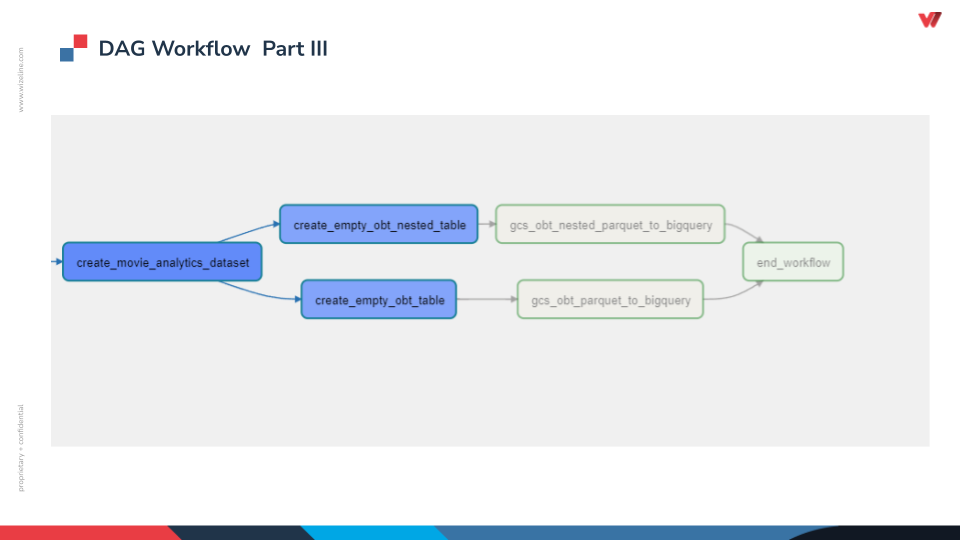

# Wizeline Capstone Project
---

## Problem Description

A user behavior analytics company wants to start getting business insights from their customer purchases and movie reviews data.

So, they need a D.E. capable of design and implement a Data Warehouse architecture for fast and easy to understand queries with cloud services.  

## Tools and Services Used

A quick view of all services used in this project.

## Architecture Design

GCP architecture design with all cloud services used and deployed. The security stage is still in process. 

## Dags preview

### Part I
Extraction of databases from GCS and Postgres CloudSQL to GCS as Raw data. 

### Part II
Create DataProc to run cleaning, transformation and aggregation operations with python scripts.

### Part III
Create Bigquery datasets to load an OBT table, which is the data warehouse proposed.

## Denormalization process

Step by step denormalization process perform on the three initial databases to the final OBT table.

## Data warehouses proposed

Notice that two design were expose for the data warehouse, however, due to BigQuery engines and documentation suggestion an OBT schema was prefered above the star schema.

## Next steps

- IAM roles and secrets
- Business insights with Data Studio
- ML model for review tagging
- CI / CD for python script use by DataProc
- Data quality logging steps in airflow
- Architecture diagram as code

## Lessons learned

- Write down your thoughts before coding

- DataProc clusters can be deploy within airflow, but there isn’t too much documentation about it 

- OBT schema is a better approach when working with columnar storage DW like BigQuery

# Thanks for getting here!!

